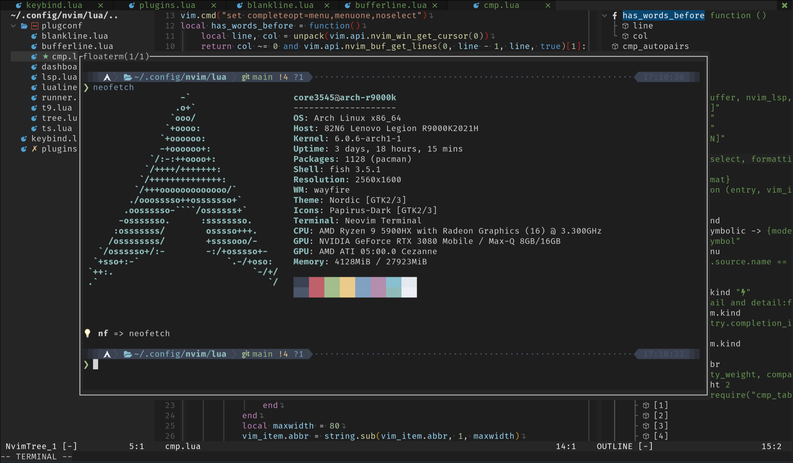

# nvim-config



A Neovim configuration that works out of the box.
- Fast :
Most of the configuration files are written in lua.
- User friendly : Including many essential plugins.
- Lsp : Use nvim's built-in lsp.
- Floaterm
- Markdown preview
- Code runner
- ...

For more information, see plugins.lua.

## usage

1.Install Packer.nvim.
```sh
git clone --depth 1 https://github.com/wbthomason/packer.nvim\
 ~/.local/share/nvim/site/pack/packer/start/packer.nvim
```

2.Backup your original configuration.
```
mv ~/.config/nvim ~/.config/nvim.back 
```

3.Clone this repository.
```sh
git clone --depth 1 https://github.com/ston-afk/nvim-config\
 ~/.config/nvim
```

4.Run ":PackerSync" in neovim.
```vim
:PackerSync
```
## keymap
### Session

`<leader>ss` create a session

`<leader>sl` load a session

### Markdown

`<leader>m` markdown preview

### Outline

`<leader>o` `<F6>` symbols outline

### Buffers

`<leader>bd` delete a buffer

`<leader>bp` `<F2>` go to the previous buffer

`<leader>bn` `<F3>` go to the next buffer

### Format

`<F4>` formatting the buffer with neoformat

### Terminal

`<F9>` create a floating terminal

`<F10>` go to the previous floating terminal

`<F11>` go to the next floating terminal

`<A-d>` `<F12>` toggle floating terminal

### Code Runner

`<leader>r` `<F5>` run code

`<leader>rf` run file

please refer to the `keybind.lua` for more keymaps.

### Nvim Tree

`<leader>n` `<F1>` toggle nvim tree

### Telescope

`<leader>ff` find file

`<leader>fg` find live_grep

`<leader>fb` find opened buffers

`<leader>fh` find help

### Lsp

`gh` run the lsp finder(lspsaga)

`ca` code action

`gr` rename

`gd` peek definition

`cd` show the diagnostics of the symbol under the cursor

`e] [e`  `E] [E` go to the next(previous) diagnostic(error)

`K` show the document of the symbol under the cursor

