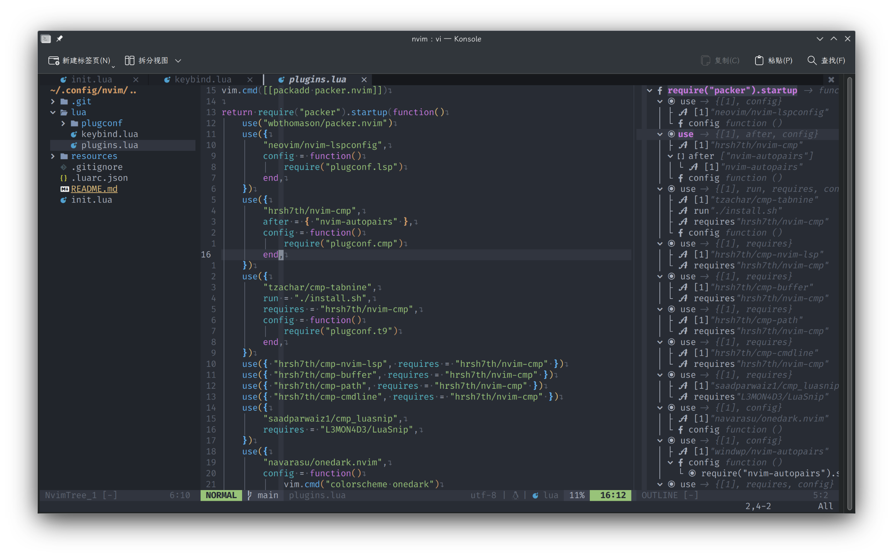

# nvim-config

<!--toc:start-->
- [nvim-config](#nvim-config)
  - [usage](#usage)
  - [keymap](#keymap)
<!--toc:end-->



A Neovim configuration that works out of the box

- Fast :
Most of the configuration files are written in lua
- User friendly : Including many essential plugins
- Lsp : Use nvim's built-in lsp
- Floaterm
- Markdown preview
- Code runner
- ...

For more information, see plugins.lua

## usage

1.Install Packer.nvim

```sh
git clone --depth 1 https://github.com/wbthomason/packer.nvim\
 ~/.local/share/nvim/site/pack/packer/start/packer.nvim
```

2.Backup your original configuration

```sh
mv ~/.config/nvim ~/.config/nvim.back 
```

3.Clone this repository

```sh
git clone --depth 1 https://github.com/ston-afk/nvim-config\
 ~/.config/nvim
```

4.Run ":PackerSync" in neovim

```vim
:PackerSync
```

## keymap

see [keybind.lua](./lua/keybind.lua) for more information.
